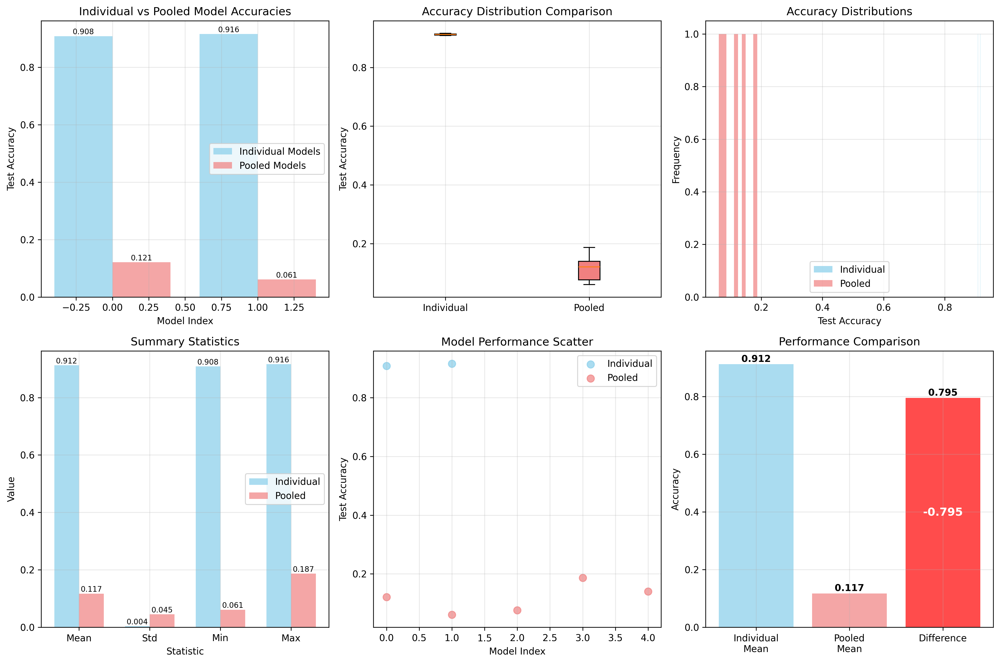

I overheard Lucas Teixeira claiming that when you use SGLD to sample a family of n 2-layer MLPs trained on an MNIST task, each with m neurons, and then sample m neurons from the combined nm neuron pool of all MLPs found with this process, then the random reconstruction performs reasonably well on the MNIST classification task. This is mostly an attempt to try to replicate that. 

(Obviously the code here should not be taken as any indication of either their research program or the validity of their results)

## Experimental Results

We do not find evidence of this phenomenon, perhaps the experimental setup should be different (or perhaps we're not all sampling from the same basin)

